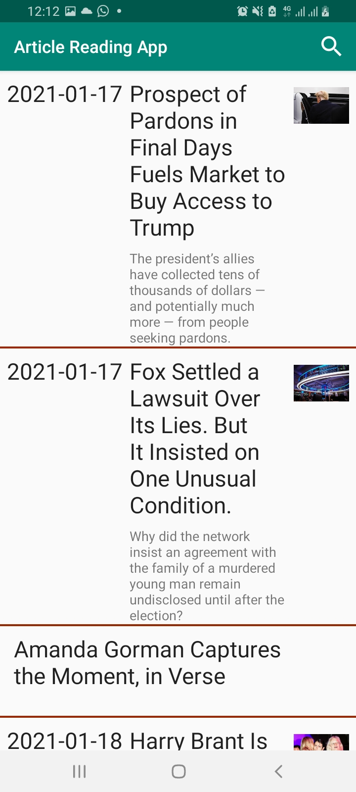

# NYTimes ArticlesReading App using MVVM Base Architecture App and Architectural Components
NY Times api usage with using new android mvvm pattern architecture

The application has been built with **offline support**. It has been designed using **Android Architecture components** with **Room** for offline data caching. The application is built in such a way that whenvever there is a service call, the result will be stored in local database.

The whole application is built based on the MVVM architectural pattern.

# Application Architecture


The main advatage of using MVVM, there is no two way dependency between ViewModel and Model unlike MVP. Here the view can observe the datachanges in the viewmodel as we are using LiveData which is lifecycle aware. The viewmodel to view communication is achieved through observer pattern (basically observing the state changes of the data in the viewmodel).

# Screenshots
 

# Programming Practices Followed
a) Android Architectural Components <br/>
b) Dagger 2 for Dependency Injection <br/>
c) MVVM <br/>
d) Retrofit <br/>
e) Room for data caching <br/>
f) JUnit and Mockito for Unit testing <br/>
d) Repository pattern <br/>


# How to build ?

Open terminal and type the below command to generate debug build <br/>

``` ./gradlew assembleDebug ```

Open terminal and type the below command to generate release build <br/>

``` ./gradlew assembleRelease ```


### NYTimes API Information
https://developer.nytimes.com/docs/articlesearch-product/1/overview